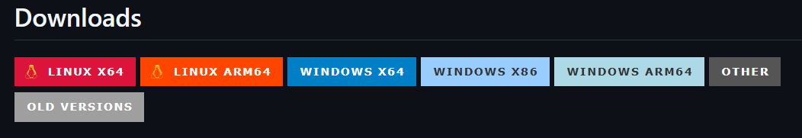
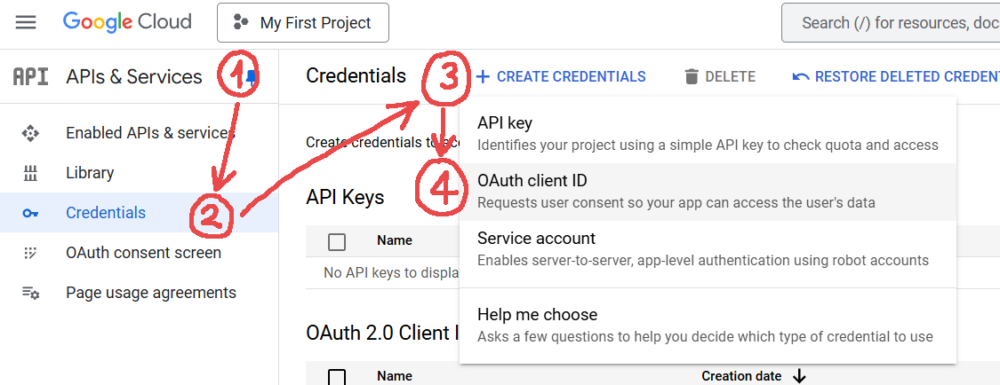
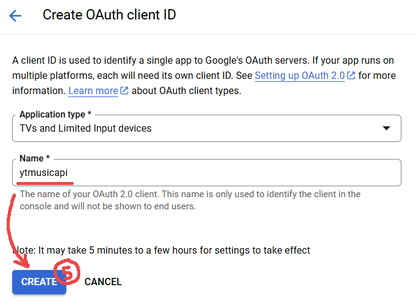
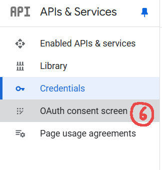
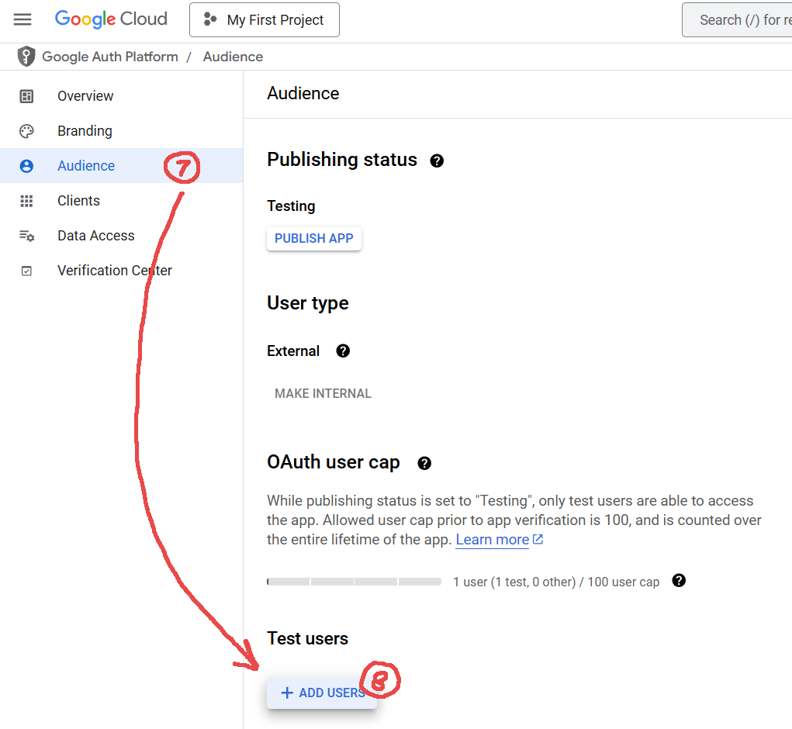
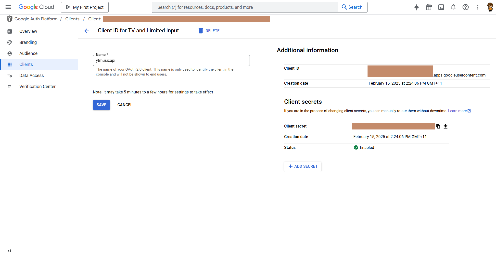
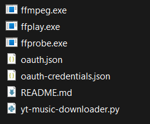

# yt-music-downloader

A pretty basic python script for bulk downloading whole playlists, individual songs, or liked songs from your YouTube Music account.

## How to use

#### Pre-reqs

Install pip dependencies
-Recommended: Use a `venv` for managing pip dependencies -

- `pip install ytmusicapi`
- `pip install yt_dlp`
- `pip install mutagen`

- Compatible `ffmpeg` from https://github.com/yt-dlp/FFmpeg-Builds. Just download the right package for your system from the GitHub Downloads section, e.g. WINDOWS X64.
  
  You should get a zip like `ffmpeg-master-latest-win64-gpl.zip`. Extract the contents and place the `.exe` files (`ffmpeg.exe`, `ffplay.exe`, `ffprobe.exe`) from the bin directory into the same directory as `yt-music-downloader.py`

Authentication

##### #1 - `oauth.json`

This file is generated by ytmusicapi. Read this guide to get started:
https://ytmusicapi.readthedocs.io/en/stable/setup/oauth.html

NB: Getting this setup is really ~~ass~~ awesome. I got it working by doing the following:








- And then add the email associated with your YouTube account as a test user. This should help to get the auth ready so that when you run `ytmusicapi oauth` (in the directory where the `ytmusicapi` pip package got installed), you can plug in the credentials from Google Cloud and sign in using your YouTube account.
  Doing so should generate the `oauth.json`.

##### #2 - `oauth-credentials.json`

After following the ytmusicapi auth setup, you need to overwrite the "client_id" and "client_secret" values in `oauth-credentials.json` json with your own credentials from your Google Cloud api token.

Use this format for the json:

```
{
  "client_id": "xxxxxxxxxxxx-xxxxxxxxxxxxxxxxxxxxxxxxxxxxxxxx.apps.googleusercontent.com",
  "client_secret": "xxxxxx-xxxxxxxxxxxxxxxxxxxxxxxxxxxx"
}
```

A template for this json has been included in the repo, so you can just replace the "xxxx"s with your data.
Now, place both `.json` files in the same directory as `yt-music-downloader.py`

Your directory should now look something like this:



Now you should be able to run the python script.

#### Running the script

`python yt-music-downloader.py <songs> <output directory> <file format> <songs limit>`

##### Options:

- `songs`: playlist url | single song url | `likes` | `history`
- `OPTIONAL: output directory`: Directory that songs will be saved to. Default: `~Music`
- `OPTIONAL: file format`: `mp3` | `m4a`. Default: `m4a`
- `OPTIONAL: songs limit`: int representing the max songs to download. This might be cooked if it's too high, idk lol. Default: `500`

##### Examples:

`python yt-music-downloader.py https://music.youtube.com/playlist?list=OLAK5uy_mYSaNtStTaoKs1hOPwuRELXlEwNI6amFo D:\\YtMusic mp3`
<sub><sup>Download 'My Merry May' OST playlist into the D-drive in mp3 format</sup></sub>

`python yt-music-downloader.py https://music.youtube.com/watch?v=LCkiKoORZZo`
<sub><sup>Download the song 'Once We Part Ways' into the default Music directory in default .m4a format</sup></sub>

`python yt-music-downloader.py likes D:\\YtMusic m4a 50`
<sub><sup>Download the last `50` songs you've liked into the D-drive in m4a format</sup></sub>

##### Repeat downloads

To save time when repeat downloading, this script pre-checks the specified output directory to see if the songs you are about to download already exist or not. If the song already exists in either `.m4a` or `.mp3` format, the download will be skipped. Duplicates are checked by saving the YouTube video ID to the 'genre' file metadata tag, and checking this against the video IDs queued to download.
This is handy for scheduling the script to download a playlist like your 'liked' songs on a recurring basis, where only missing songs are downloaded.
